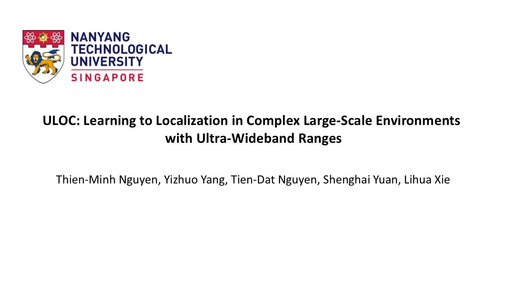

## ULOC: Learning to Localize in Complex Large-Scale Environments with Ultra-Wideband Ranges

<!-- 
<div style="text-align: center;">
    Design of the learning model
</div>

<br/> -->

**Introduction video**:
<div align="center">
    <a href="https://youtu.be/vNIGS4iio8o" target="_blank">
    
</div>

Papers:
[arxiv](https://arxiv.org/pdf/2409.11122)

## How to run?

Git clone this repo and checkout the uloc.ipynb.

## If you use the data or resources from this repo please consider citing us by

For the source code
```
@article{nguyen2024uloc,
  title     = {ULOC: Learning to Localize in Complex Large-Scale Environments with Ultra-Wideband Ranges},
  author    = {Nguyen, Thien-Minh and Yang, Yizhuo and Nguyen, Tien-Dat and Yuan, Shenghai and Xie, Lihua},
  journal   = {arXiv preprint arXiv:2409.11122},
  year      = {2024}
}
```

For the dataset
```
@inproceedings{nguyen2024mcd,
  title     = {Mcd: Diverse large-scale multi-campus dataset for robot perception},
  author    = {Nguyen, Thien-Minh and Yuan, Shenghai and Nguyen, Thien Hoang and Yin, Pengyu and Cao, Haozhi and Xie, Lihua and Wozniak, Maciej and Jensfelt, Patric and Thiel, Marko and Ziegenbein, Justin and others},
  booktitle = {Proceedings of the IEEE/CVF Conference on Computer Vision and Pattern Recognition},
  pages     = {22304--22313},
  year      = {2024}
}
```
